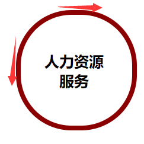
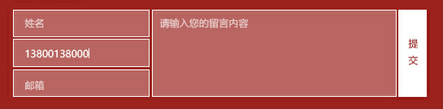

#### 总体

开发技巧设置

 *设置border{0.001rem solid}可以观察每个模块的大小边

**包围标签：双击div标签开头选中标签内容2、按Ctrl+]包围3、输入div即可在首尾添加包围标签**

反包围：双击标签开头选中标签内容2、按Ctrl+shift+]反包围3、可去掉最外层的p标签并自动处理子节点的缩进

撤销多选光标的最后一个光标：双击选中class2、按下Ctrl+e选中相同词3、按Ctrl+shift+z不再选中最后一个词

ctr+/ 注释或反注释

**转到定义：Alt+d**

**折叠其他选区：Alt+Shift+o。**

**左边的大纲是长文档导航的利器。alt+w激活它(mac是ctrl+w)**

```
a{text-decoration: none;color: black;}
*{margin: 0;padding: 0;}/*清除所有元素自带的margin和padding属性以便调整*/
.content{width:55.625rem;margin: 0 auto;}/*margin:0 auto 用于居中一整个块元素*
```


清除a自带样式，清除所有元素自带内外边距

居中整个大块元素


每个元素顶部的左右划线和文字


使用三个div模块 左线文字右线 并用text-align对中间文字进行自动居中

```
.linetext{display:inlineblock;width:21.25rem;text-align:center;position:relative;bottom:0.625rem;}
.left{height: 0.15625rem;width:17.1875rem;float: left;background-color: gray;}
.right{height:0.15625rem;width:17.1875rem;float: right;background: gray;}
```

设计稿原版


可以看出左右线少了圈圈 仍有差距

之前用过两个div模拟圆但是接合处过于粗糙；圈圈目前想到的解决方案是用边框圆角解决；

#### 顶部（top）


这是demo


这是设计稿

可以看出两个虚线的密度不同

未解决

#### 第一部分（one)


```
#content_one li{display: table-cell;text-align: center;vertical-align: middle;}/*display li ul父子元素配合 转化为表格模式使其可以横向显示并均匀分配空间*/
#content_one ul{width: 34.375rem;float: right;height: 4.1875rem; display:table;list-style: none;font-size: smaller;font-weight: 800;}
```

ul横向排布+均匀对齐

ul内添加display：table 每个li内添加display：table-cell 使其拥有表格均匀分割的性质


用到了border-radius使边角圆滑

#### 第二部分（two）


可以看出 hover上方时 图片/字体/下划线/颜色变白 背景颜色变红

伪类无法控制图片更换 使用js获取元素改变style属性等

```
var content=document.querySelectorAll(".text");
			var img=document.querySelectorAll(".text img")
			var p1=document.querySelectorAll(".p1")
			var p2=document.querySelectorAll(".p2")
			var p3=document.querySelectorAll(".p3")
			var p4=document.querySelectorAll(".p4")
			content[0].onmouseover=function()
			{
				p1[0].style.color="white";
				p2[0].style.color="white"
			    p3[0].style.backgroundColor="white"
				p4[0].style.color="white"
				img[0].src="img/1.2.png"
			}
			content[0].onmouseleave=function()
			{
				p1[0].style.color="black";
				p2[0].style.color="gray"
			    p3[0].style.backgroundColor="#808080"
				p4[0].style.color="gray"
				img[0].src="img/1.1.png"
			}
```

分别对六个模块（以上代码为控制第一个，以此类推）控制鼠标悬浮和移出鼠标的事件

#### 第三部分（three）

圆的实现公式：border-radius=（width=height）/2

之前版本


这是设计稿


很明显看出边框细了一些为什么不加粗呢？

这是加粗后

很明显看出这个圆视觉上扁了一些 因为边框太粗使最远的部分稍稍被截断了一点点

这是改进后

```
width:8.875rem ;height:8.875rem ; border-radius:4.6875rem ;
```

大致算一下border-radius>width=height

可以看出不需要教条式遵守百分之50的公式特别是粗边框的圆的时候

拓展radius属性

border-radius完全写法是

border-radius：xx xx xx xx/ xx xx xx xx 

分别代表

左上右上右下左下的水平/垂直半径

制作几何图形复制以后再学习

#### 第四第五部分

略

#### 底部（bottom）

今天3.25对底部进行了较大改进（）

这是改进前

这是设计稿

可以看出原版的背景为虚化的红色 每个text框之间有微小的间距 提交按钮的字是竖直居中的

一开始我在为寻找对背景颜色淡化的背景颜色属性而苦恼 ，寻找一番无果后突然明白

**虚化的背景颜色也是一种颜色**

对原稿用ps的取色器进行取色基本还原了颜色


但是当时还有一个问题

使用了placeholder属性 提示框的颜色为默认无法修改

上网寻找找到这段代码 解决（提示字变为上上图的灰色）

```
::-webkit-input-placeholder {color: #cccccc;}
/* Mozilla Firefox 4 to 18 */
			:-moz-placeholder {color:#cccccc;opacity: 1;}
			/* Mozilla Firefox 19+ */
			::-moz-placeholder {color:#cccccc;opacity: 1;}
			/* Internet Explorer 10+ */
			:-ms-input-placeholder {color:;}
```

仍有不足 原稿text和textarea 是开始处就缩进了


仍要改进

#### 右侧固定框（fixed）

略


之前将px单位换为rem单位，浏览器缩放问题改善了很多，今天将代码手动缩进了一下

仍为搞懂vertical-align的用法经常添加后无用会先看此知识；

​                      													--3.26 2am

边框阴影语法

box-shadow:0px 0px 1px #000
第1个值为0时，代表左右边框阴影 为1px范围
第1个值为正整数 代表 左边框阴影
第1个值为负整数 代表 右边框阴影
同理
第2个值为0 代表上下边框阴影
第2个值为正整数 代表1px阴影距离上边框多少
第1个值为负整数 代表下边框阴影设置

```
box-shadow:0.09rem 0.09rem 0.1875rem gray;
```


